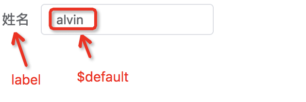
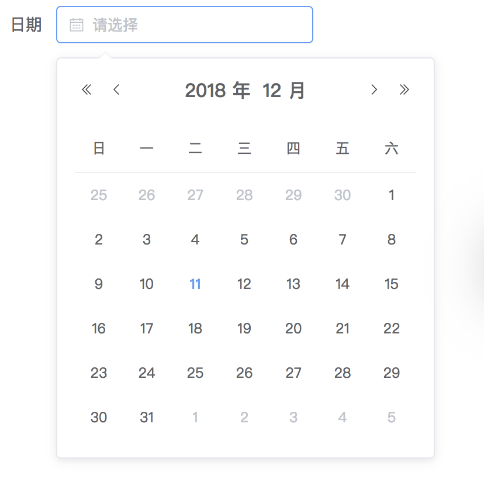
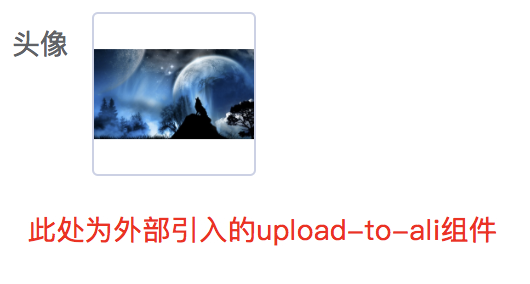

# el-form-renderer

基于 [element-ui](https://github.com/ElemeFE/element) 封装的表单渲染器，完整继承了 element 的form表单属性，并进行了简单扩展，从而用户能够通过使用一段预设的数据渲染出一个完整的 element 表单。

## Table of Contents

1. **[Feature](#feature)**
2. **[Documentation](#documentation)**
3. **[Quick start](#quick-start)**
4. **[Example](#example)**
5. **[Props](#props)**
6. **[Methods](#methods)**
7. **[Slot](#slot)**
8. **[Redev](#redev)**
9. **[License](#license)**

## Feature

#### fork 的版本

##### v1.1.0

- 支持局部注册组件
- 支持使用自定义组件
- 批量更新数据 updateForm

#### 原版本

- 完整继承了 element 的 form 表单属性
- 只需进行简单的配置，即可实现常用表单功能

**[⬆ Back to Top](#table-of-contents)**

## Documentation

- [English Document](./README.en.md)

**[⬆ Back to Top](#table-of-contents)**

## Quick start

```vue
// Step1 确认你已经正确安装并使用了 element-ui

// Step2 安装
yarn add @femessage/el-form-renderer

// Step3 在需要使用该渲染器的 .vue 文件中
<template>
  <el-form-renderer :content="content"></el-form-renderer>
</template>

<script>
import ElFormRenderer from '@femessage/el-form-renderer'

export default {
  components: {
    ElFormRenderer
  },
  data () {
    return {
      content: []
    }
  }
}
</script>
```
**[⬆ Back to Top](#table-of-contents)**

## Example

以下例子，如果没有指定template，则统一为：

```vue
<template>
  <el-form-renderer :content="content" inline></el-form-renderer>
</template>
```

### input

```js
export default {
  name: 'input-example',
  data() {
    return {
      content: [
        {
          $id: 'name',
          $type: 'input',
          label: '姓名',
          $default: 'alvin',
          $el: {
            placeholder: '请输入'
          }
        }
      ]
    }
  }
}
```

展示效果：




### select

```js
export default {
  name: 'select-example',
  data() {
    return {
      content: [
        {
          $id: 'area',
          $type: 'select',
          label: '选择框',
          $el: {
            placeholder: '请选择内容'
          },
          $options: [{
            label: '区域一',
            value: 'shanghai'
          }, {
            label: '区域二',
            value: 'beijing'
          }]
        }
      ]
    }
  }
}
```

展示效果：


###  radio-group

```js
export default {
  name: 'radio-group-example',
  data() {
    return {
      content: [
        {
          $id: 'city',
          $type: 'radio-group',
          label: '城市',
          $el: {
            placeholder: '请输入'
          },
          $default: '广州',
          $options: [
            // 注意：element radio-group 通过 label 而不是 value 来匹配值
            { label: '上海' },
            { label: '北京' },
            { label: '广州' },
            { label: '深圳' }
          ]
        }
      ]
    }
  }
}
```

展示效果：


###  date-picker

```js
export default {
  name: 'date-picker-example',
  data() {
    return {
      content: [
        {
          $id: 'date',
          $type: 'date-picker',
          label: '日期',
          $el: {
            placeholder: '请选择',
            valueFormat: 'timestamp'  // 不使用 value-format 属性，则获取到的是一个空对象，格式请参考 element-ui 组件 date-picker 的日期格式部分
          }
        }
      ]
    }
  }
}
```

展示效果：



### upload(自定义组件)

```js
// https://github.com/FEMessage/upload-to-ali

import UploadToAli from 'upload-to-ali'
export default {
  name: 'upload-example',
  data() {
    return {
      content: [
        {
          $id: 'avatar',
          component: UploadToAli,
          label: '头像'
        }
      ]
    }
  }
}
```

展示效果：



### updateFormValue

```vue
<template>
  <div class="update-form-value">
    <el-form-renderer :content="content" inline ref="formRender">
      <el-button @click="setValue">设置名字</el-button>
      <el-button type="primary" @click="getValue">获取数据</el-button>
    </el-form-renderer>
  </div>
</template>

<script>
  export default {
    name: 'update-form-value',
    data() {
      return {
        content: [
          {
            $id: 'name',
            $type: 'input',
            label: '姓名',
            $el: {
              placeholder: '请输入'
            }
          },
          {
            $id: 'area',
            $type: 'select',
            label: '选择框',
            $el: {
              placeholder: '请选择内容'
            },
            $options: [{
              label: '区域一',
              value: 'shanghai'
            }, {
              label: '区域二',
              value: 'beijing'
            }]
          }
        ]
      }
    },
    methods: {
      getValue () {
        const value = this.$refs.formRender.getFormValue()
        console.log(value)  // 输出为对应$id 和值组成的对象
      },
      setValue () {
        this.$refs.formRender.updateValue({
          id: 'name',
          value: 'alvin'
        })
      }
    }
  }
</script>
```

展示效果：


### nextTick

```vue
<template>
  <div class="nextTick">
    <el-button type="text" @click="dialogVisible = true">点击打开 Dialog</el-button>

    <el-dialog :visible.sync="dialogVisible" title="nextTick" @open="handleOpen">
      <el-form-renderer :content="content" inline ref="formRender"></el-form-renderer>
    </el-dialog>
  </div>
</template>

<script>
  export default {
    name: 'nextTick',
    data() {
      return {
        dialogVisible: false,
        content: [
          {
            $id: 'name',
            $type: 'input',
            label: '姓名',
            $el: {
              placeholder: '请输入'
            }
          }
        ]
      }
    },
    methods: {
      handleOpen () {
        // Dialog 的内容是懒渲染的，即在第一次被打开之前，传入的默认 slot 不会被渲染到 DOM 上，所以需要使用 nextTick 等待 DOM 更新之后才能通过 $refs 获取到该实例
        console.log(this.$refs.formRender)  // 第一次打开时为 undefined
        this.$nextTick(() => {
          console.log(this.$refs.formRender)  // 始终能获取到该实例
        })
      }
    }
  }
</script>
```


**[⬆ Back to Top](#table-of-contents)**

## Props

* 支持 [el-form](http://element.eleme.io/#/zh-CN/component/form) 上的所有属性。

* `disabled` [Boolean] 设置为 `true` 可禁用所有原子表单。`element-ui` 版本如果在 `2.1.0` 以下本渲染器依旧兼容。

* `content` [ObjectArray] 定义表单的内容，每一个 `Object` 代表一个原子表单(`el-input, el-select, ...`)，一切 `el-form-item` 上的属性都可在此声明，而对于 `el-input` 等之上的属性在 `$el` 属性上进行声明，该 `Object` 上还存在其他属性，例如: `$id`,` $type/component`, `$default`,`$enableWhen`[可选], `$options`[可选], `$attrs`[可选]

```js
// content example
[
  {
    $id: "form1", // 每一个原子都存在id，用于存储该原子的值，注意不能重复
    $type: "input", // 类型，element 提供的所有表单类型，即 el-xxx
    $enableWhen: { form2: 'beijing' }, // 可选属性，表示当 form2 的值为 beijing 时显示
    $attrs: { 'data-name': 'form1' }, // 可选, 写法与 Vue 的 Render 函数规范保持一致
    label: "输入框", // el-form-item上的属性
    $default: "这是默认值",
    rules: [{ required: true, message: '请输入活动名称', trigger: 'blur' }] // el-form-item上的属性
  }, {
    $id: "form2",
    $type: "select",
    label: "选择框",
    // $el 上用于定义具体原子表单(此处为el-select)的属性
    $el: {
      placeholder: "请选择内容"
    },
    // $options 具有选择功能的原子表单可用此定义可选项，例如: select, radio-group, radio-button, checkbox-group, checkbox-button
    $options: [{
      label: '区域一',
      value: 'shanghai'
    }, {
      label: '区域二',
      value: 'beijing'
    }]
  }
]
```

此外，我们为 `$type` 属性增加了一个可选值: `group`，可用于创建更为复杂的表单数据类型:

```js
// 该例将获得对象数据结构:
// group1: {
//   input1: '',
//   input2: ''
// }
{
  $id: "group1", // 遵循同一层级的ID不重复的原则，实质上相当于对象的键
  $type: "group",
  label: "这是一个对象数据",
  $items: [{
    $id: "input1",
    $type: "input",
    label: "输入框1",
    $default: "这是默认值"
  }, {
    $id: "input2",
    $type: "input",
    label: "输入框2",
    $default: "这是默认值",
  }]
}
```

为了满足局部注册组件和使用自定义组件的需求，我们在原有组件的基础上拓展了原子表单的`component`属性，用于使用局部注册和自定义的组件

注意： `component`适用于渲染局部注册组件和使用自定义组件，而`$type`适用于带`el-`前缀的全局组件

```js
{
  $id: 'avatar',
  component: UploadToAli,  // UploadToAli 为非 ElementUI 组件，从外部引入
  label: '头像'
}
```

**[⬆ Back to Top](#table-of-contents)**

## Methods

* 支持 [el-form](http://element.eleme.io/#/zh-CN/component/form) 上的所有方法。

* 其他方法:

| 方法名       | 描述                 | 参数                       |
| ------------ | -------------------- | -------------------------- |
| getFormValue | 获取当前表单的值     | -                          |
| updateValue  | 手动更新表单的值     | ({ id: id, value: value }) |
| updateForm   | 手动批量更新表单的值 | Object                     |

**[⬆ Back to Top](#table-of-contents)**

## Slot

* 支持通过默认 `slot` 往表单尾部插入自定义 `VNode`。

**[⬆ Back to Top](#table-of-contents)**


## Redev

install dependency

```sh
yarn

yarn add element-ui -P
```

run dev server

```sh
yarn dev
```

publish to npm

```sh
npm version

yarn dist

cd dist

npm publish --access public
```

**[⬆ Back to Top](#table-of-contents)**

## License

[MIT](./LICENSE)

**[⬆ Back to Top](#table-of-contents)**
